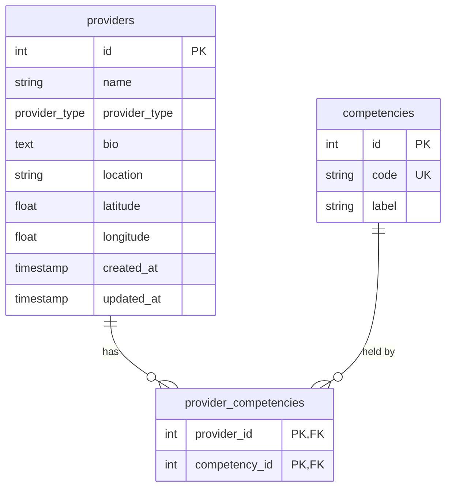

# Database Schema

The Postgres schema for Vouch. This file covers the Phase 1 tables; update it whenever a migration changes the schema.

---

## Overview

- **providers**: the person offering the service.
- **competencies**: the fixed list of skills a provider can have.
- **provider_competencies**: links providers to competencies (a many-to-many relationship).

---

## `providers`

One row per carer or driver.

| Column | Type | Constraints | Notes |
|---|---|---|---|
| `id` | integer | primary key, auto-increment | |
| `name` | varchar(255) | not null | |
| `provider_type` | enum `provider_type` (`carer`, `driver`) | not null | A provider is exactly one type, never both. |
| `bio` | text | nullable | Free-text description. Phase 2 verification reads this. |
| `location` | varchar(255) | nullable | City or postcode. No geospatial search in Phase 1. |
| `latitude` | double precision | nullable | Optional. Used for distance scoring in Phase 3. |
| `longitude` | double precision | nullable | Optional. Used for distance scoring in Phase 3. |
| `created_at` | timestamptz | not null, default `now()` | |
| `updated_at` | timestamptz | not null, default `now()` | Updated whenever the row changes. |

**Indexes:** `provider_type` (search filters on it).

---

## `competencies`

The fixed list of allowed skills. The `/search` LLM prompt (step 1.5) is given these codes, and any code it returns that isn't in this table is rejected.

| Column | Type | Constraints | Notes |
|---|---|---|---|
| `id` | integer | primary key, auto-increment | |
| `code` | varchar(64) | not null, unique | Machine-readable tag, snake_case. e.g. `hoist_transfer` |
| `label` | varchar(255) | not null | Display name for the UI. e.g. `Hoist transfer` |

**Example rows:**

| code | label |
|---|---|
| `hoist_transfer` | Hoist transfer |
| `bsl_fluent` | Fluent in BSL |
| `first_aid` | First aid |

---

## `provider_competencies`

Which provider has which competency. One row per pair.

| Column | Type | Constraints | Notes |
|---|---|---|---|
| `provider_id` | integer | foreign key → `providers.id`, on delete cascade | |
| `competency_id` | integer | foreign key → `competencies.id`, on delete restrict | |

**Primary key:** (`provider_id`, `competency_id`), so a provider can't have the same competency twice.

**Indexes:** `competency_id` (for "all providers with competency X" queries; `provider_id` is already covered by the primary key).

**On delete:** deleting a provider removes their competency links. Deleting a competency that providers still hold is blocked.

---

## Planned changes in later phases

Not built yet. Listed so Phase 1 doesn't make choices that block them.

| Phase | Change |
|---|---|
| 2 | Add `status` (`corroborated` / `self_reported` / `documented_only`) and `confidence` to `provider_competencies`. Add a `documents` table linked to `providers`. |
| 3 | Add `users` and `user_profiles` tables. Distance scoring uses `providers.latitude` / `longitude`. |
| 4 | Add `availability` and `bookings` tables. Bookings store a JSON snapshot of verification data, not just a foreign key. |
| 5 | Add login fields (e.g. `email`, `password_hash`) to `providers`. |
