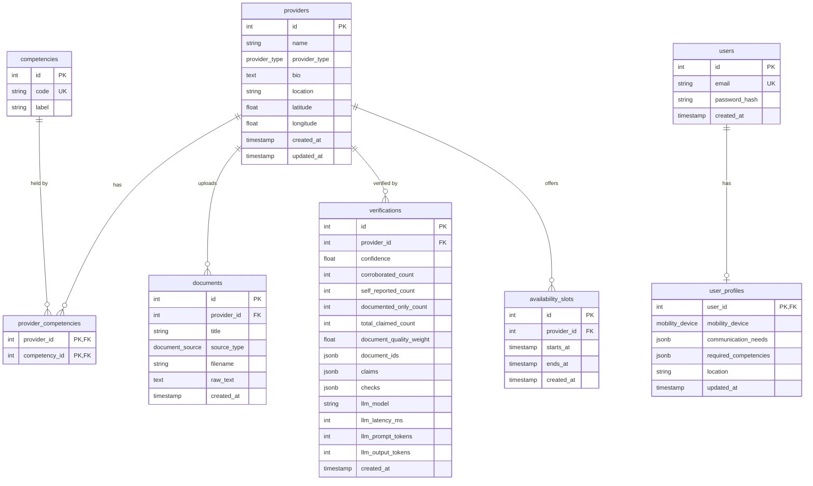

# Database Schema

The Postgres schema for Vouch. Update this file whenever a migration changes the schema.

---

## Overview

- **providers**: the person offering the service.
- **competencies**: the fixed list of skills a provider can have.
- **provider_competencies**: links providers to competencies (a many-to-many relationship).
- **documents**: evidence a provider uploads, such as a certificate (Phase 2).
- **verifications**: each verification run's confidence score and the inputs behind it (Phase 2).
- **users**: people searching for a carer or driver, with hashed passwords (Phase 3).
- **user_profiles**: a user's saved accessibility needs, one per user (Phase 3).
- **availability_slots**: specific time windows a provider can be booked for (Phase 4).

---

## `providers`

One row per carer or driver.

| Column | Type | Constraints | Notes |
|---|---|---|---|
| `id` | integer | primary key, auto-increment | |
| `name` | varchar(255) | not null | |
| `provider_type` | enum `provider_type` (`carer`, `driver`) | not null | A provider is exactly one type, never both. |
| `bio` | text | nullable | Free-text description. Phase 2 verification reads this. |
| `location` | varchar(255) | nullable | City or postcode. No geospatial search in Phase 1. |
| `latitude` | double precision | nullable | Optional. Used for distance scoring in Phase 3. |
| `longitude` | double precision | nullable | Optional. Used for distance scoring in Phase 3. |
| `created_at` | timestamptz | not null, default `now()` | |
| `updated_at` | timestamptz | not null, default `now()` | Updated whenever the row changes. |

**Indexes:** `provider_type` (search filters on it).

---

## `competencies`

The fixed list of allowed skills. The `/search` LLM prompt (step 1.5) is given these codes, and any code it returns that isn't in this table is rejected.

| Column | Type | Constraints | Notes |
|---|---|---|---|
| `id` | integer | primary key, auto-increment | |
| `code` | varchar(64) | not null, unique | Machine-readable tag, snake_case. e.g. `hoist_transfer` |
| `label` | varchar(255) | not null | Display name for the UI. e.g. `Hoist transfer` |

**Example rows:**

| code | label |
|---|---|
| `hoist_transfer` | Hoist transfer |
| `bsl_fluent` | Fluent in BSL |
| `first_aid` | First aid |

---

## `provider_competencies`

Which provider has which competency. One row per pair.

| Column | Type | Constraints | Notes |
|---|---|---|---|
| `provider_id` | integer | foreign key → `providers.id`, on delete cascade | |
| `competency_id` | integer | foreign key → `competencies.id`, on delete restrict | |

**Primary key:** (`provider_id`, `competency_id`), so a provider can't have the same competency twice.

**Indexes:** `competency_id` (for "all providers with competency X" queries; `provider_id` is already covered by the primary key).

**On delete:** deleting a provider removes their competency links. Deleting a competency that providers still hold is blocked.

---

## `documents`

Evidence a provider uploads, such as a certificate. Only the extracted text is stored, not the original file.

| Column | Type | Constraints | Notes |
|---|---|---|---|
| `id` | integer | primary key, auto-increment | |
| `provider_id` | integer | not null, foreign key → `providers.id`, on delete cascade | |
| `title` | varchar(255) | nullable | e.g. `First aid certificate`. Defaults to the filename for uploads. |
| `source_type` | enum `document_source` (`pasted`, `text_file`, `pdf`) | not null | How the text was obtained. Lets the confidence score weight sources differently. |
| `filename` | varchar(255) | nullable | Original filename. Null for pasted text. |
| `raw_text` | text | not null | Cleaned text: whitespace normalised, up to 100,000 characters. |
| `created_at` | timestamptz | not null, default `now()` | |

**Indexes:** `provider_id`.

**On delete:** deleting a provider removes their documents.

---

## `verifications`

One row per verification run. Rows are never updated, so a provider's history is kept; the newest row is their current status. Stores the score *and* every input used to calculate it, so any score can be explained later.

`confidence = corroborated_count / total_claimed_count * document_quality_weight` (0 when nothing is claimed).

| Column | Type | Constraints | Notes |
|---|---|---|---|
| `id` | integer | primary key, auto-increment | Higher id = more recent run. |
| `provider_id` | integer | not null, foreign key → `providers.id`, on delete cascade | |
| `confidence` | double precision | not null | 0 to 1, rounded to 4 decimal places. |
| `corroborated_count` | integer | not null | Competencies in the bio and a document. |
| `self_reported_count` | integer | not null | Competencies in the bio only. |
| `documented_only_count` | integer | not null | In a document but not the bio. Doesn't affect the score. |
| `total_claimed_count` | integer | not null | `corroborated_count + self_reported_count`. |
| `document_quality_weight` | double precision | not null | Weight of the most trustworthy document; 0 with no documents. |
| `document_ids` | jsonb | not null | Ids of the documents used, e.g. `[4, 5]`. |
| `claims` | jsonb | not null | The claims extracted by the LLM: `{competency, source, snippet}`. |
| `checks` | jsonb | not null | Per-competency cross-check results: `{competency, status, bio_snippet, document_snippet}`. |
| `llm_model` | varchar(64) | nullable | The Gemini model that answered the extraction call. |
| `llm_latency_ms` | integer | nullable | Extraction time in milliseconds, including failed attempts on other models. |
| `llm_prompt_tokens` | integer | nullable | Input tokens used by the extraction call. |
| `llm_output_tokens` | integer | nullable | Output tokens used by the extraction call. |
| `created_at` | timestamptz | not null, default `now()` | |

**Indexes:** `provider_id`.

**On delete:** deleting a provider removes their verifications.

---

## `users`

People searching for a carer or driver.

| Column | Type | Constraints | Notes |
|---|---|---|---|
| `id` | integer | primary key, auto-increment | |
| `email` | varchar(255) | not null, unique | Stored lowercased, so sign-up and login ignore case. |
| `password_hash` | varchar(255) | not null | Argon2id hash. The plain password is never stored, and the hash is never returned by the API. |
| `created_at` | timestamptz | not null, default `now()` | |

## `user_profiles`

A user's saved accessibility needs. One row per user (the primary key is also the foreign key).

| Column | Type | Constraints | Notes |
|---|---|---|---|
| `user_id` | integer | primary key, foreign key → `users.id`, on delete cascade | |
| `mobility_device` | enum `mobility_device` (`none`, `manual_wheelchair`, `powered_wheelchair`, `mobility_scooter`, `walking_aid`, `other`) | nullable | |
| `communication_needs` | jsonb | not null | List of `bsl`, `lip_reading`, `written`, `easy_read`, `extra_time`. |
| `required_competencies` | jsonb | not null | List of competency codes, checked against `competencies` when saved. |
| `location` | varchar(255) | nullable | Home city or postcode, for distance ranking. |
| `updated_at` | timestamptz | not null, default `now()` | Updated whenever the row changes. |

**On delete:** deleting a user removes their profile.

## `availability_slots`

Specific time windows a provider can be booked for, e.g. Tue 7 Oct, 09:00–12:00. Chosen over recurring weekly hours because it's simpler to book against. A slot is booked as a whole.

| Column | Type | Constraints | Notes |
|---|---|---|---|
| `id` | integer | primary key, auto-increment | |
| `provider_id` | integer | not null, foreign key → `providers.id`, on delete cascade | |
| `starts_at` | timestamptz | not null | Stored with its time zone. |
| `ends_at` | timestamptz | not null | |
| `created_at` | timestamptz | not null, default `now()` | |

**Constraints:**
- `ck_availability_slots_ends_after_start`: `ends_at > starts_at`, enforced by the database.
- `uq_availability_slots_provider_start`: one slot per provider per start time.
- The API also rejects slots that overlap an existing one, start in the past, or are longer than 12 hours.

**Indexes:** `provider_id`.

**On delete:** deleting a provider removes their slots.

---

## Planned changes in later phases

Not built yet. Listed so Phase 1 doesn't make choices that block them.

| Phase | Change |
|---|---|
| 2 | Done: `documents` and `verifications` tables. Per-competency status lives in `verifications.checks` rather than on `provider_competencies`, so it's kept per run. |
| 3 | Done: `users` and `user_profiles` tables. Distance scoring will use `providers.latitude` / `longitude`. |
| 4 | Done: `availability_slots`. Still to add: `bookings`, storing a JSON snapshot of verification data, not just a foreign key. |
| 5 | Add login fields (e.g. `email`, `password_hash`) to `providers`. |
